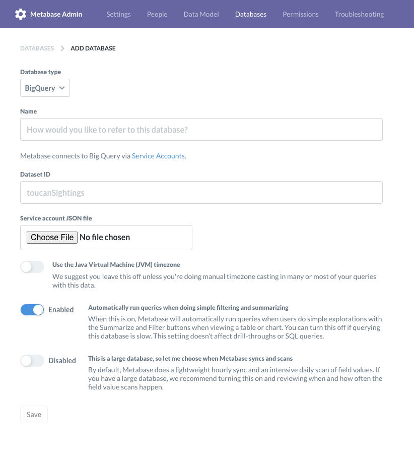

## Working with Google BigQuery in Metabase

This page provides information on how to connect Metabase to a [Bigquery](https://cloud.google.com/bigquery) dataset.

- **Starting in v0.15.0**, Metabase provides a driver for connecting to BigQuery directly and executing queries against any datasets you have.  

- **Starting in v0.36.0**, Metabase allows you to connect to your BigQuery dataset using a [Service Account](https://cloud.google.com/iam/docs/understanding-service-accounts).

## Prerequisites

You'll need to have a [Google Cloud Platform](https://cloud.google.com/) account with a [project](https://cloud.google.com/storage/docs/projects) you would like to use in Metabase. Consult the Google Cloud Platform documentation for how to [create and manage a project](https://cloud.google.com/resource-manager/docs/creating-managing-projects). This project should have a BigQuery dataset for Metabase to connect to.

## For new connections: use a service account

[Service accounts](https://cloud.google.com/iam/docs/service-accounts) are intended for non-human users (such as applications like Metabase) to authorize their API calls.

To connect Metabase to a BigQuery dataset, select **Admin** from the settings icon. In the **Setup** section, under **GET CONNECTED**, click on **Add a Database**.

From the first dropdown, **Database type**, select **BigQuery**. Metabase will present you with the relevant configuration fields to fill out:



### Fields

#### Name

**Name** is the title of your database, i.e. the name displayed for the database in the **Browse Data** screen.

#### Dataset ID

Each BigQuery dataset will have a **Dataset ID**. You can find this ID via the [Google Cloud Console](https://console.cloud.google.com/). If you're not sure where to find the Dataset ID, see Google's documentation on [getting information on datasets](https://cloud.google.com/bigquery/docs/dataset-metadata#getting_dataset_information).

> When entering the Dataset ID, omit the Project ID prefix. E.g, if your ID is `project_name:dataset_id`, only enter `dataset_id`.

#### Service Account JSON file

You'll need to upload the Service Account JSON file. This JSON file will contain the service account credentials that will grant your Metabase application the authentication (who are you?) and authorization (what can you access? what roles do you have?) to query your dataset.

To create the service account JSON file, follow Google's documentation on [setting up a service account](https://cloud.google.com/iam/docs/creating-managing-service-accounts) for your BigQuery dataset.

1. **Fill out the service account details**. 

2. **Grant service account access to this project**. You'll need to add Roles to the service account so Metabase will have permission to view and query your data. Make sure you add the following roles to the service account:

    - BigQuery Data Viewer
    - BigQuery Metadata Viewer
    - BigQuery User

3. **Create key**. Click on the **Create Key** button, and select **JSON** for the **key type**.

You'll first need to configure permissions for this service account.

### Sliders

#### Use the Java Virtual Machine (JVM) timezone

_Default: Disabled_

We suggest you leave this off unless you're doing manual timezone casting in many or most of your queries with this data.

#### Automatically run queries when doing simple filtering and summarizing.

_Default: Enabled_

When this slider is on, Metabase will automatically run queries when users do simple explorations with the Summarize and Filter buttons when viewing a table or chart. You can turn this off if querying this database is slow. This setting doesn’t affect drill-throughs or SQL queries.

#### This is a large database, so let me choose when Metabase syncs and scans

_Default: Disabled_

By default, Metabase does a lightweight hourly sync and an intensive daily scan of field values. If you have a large database, we recommend turning this on and reviewing when and how often the field value scans happen.

### Save your database configuration

When you're done, click the **Save** button.

Once you save the connection information, Metabase will inspect your BigQuery Dataset and find any tables and fields to build up a sense for the schema.  Give it a little bit of time to do its work, and then you're all set to start querying.

## For existing, legacy connections

- Start by giving this connection a __Name__ and providing your Google Cloud Platform __Project ID__ along with your desired BigQuery __Dataset ID__.  If you don't have a dataset and want to play around with something we recommend copying one of the [sample tables](https://cloud.google.com/bigquery/sample-tables)


- Follow the `Click here` link provided below the __Client ID__ field which will open a new browser tab and guide you through the process of generating OAuth 2.0 credentials for Metabase.  Make sure to choose `Other` for your application type.


- take the resulting client ID and client secret and copy them over to Metabase.


- Now follow the link below the __Auth Code__ field for `Click here to get an auth code` which will open a new browser window and authorize your credentials for a BigQuery access token to use the api.  Simply click the `Allow` button.


- Copy the resulting code provided into the __Auth Code__ field in Metabase.


### Save your database configuration

When you're done, click the **Save** button.

Once you save the connection information, Metabase will inspect your BigQuery Dataset and find any tables and fields to build up a sense for the schema.  Give it a little bit of time to do its work, and then you're all set to start querying.

## Using Legacy SQL

As of version 0.30.0, Metabase tells BigQuery to interpret SQL queries as [Standard SQL](https://cloud.google.com/bigquery/docs/reference/standard-sql/). If you prefer using [Legacy SQL](https://cloud.google.com/bigquery/docs/reference/legacy-sql) instead, you can tell Metabase to do so by including a `#legacySQL` directive at the beginning of your query, for example:

```sql
#legacySQL
SELECT *
FROM [my_dataset.my_table]
```

## Troubleshooting

If you're having trouble, check out [Metabase's discussion forum](https://discourse.metabase.com/search?q=bigquery) to see if someone has had and resolved a similar issue.

